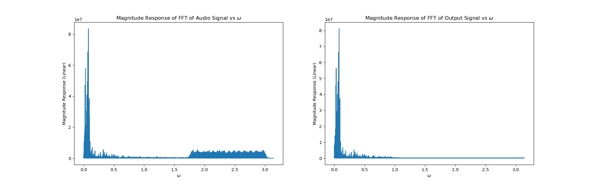
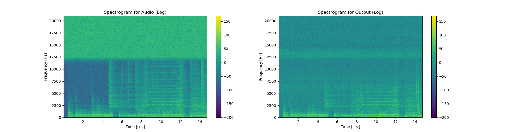

# Audio Equalizer
 
Written in SystemVerilog using Verilator and C++ for testbench and simulation. Python for visualizations, filter coefficients, and audio manipulations. It uses multiple FIR filters for each subset of frequencies. 

Example of filtering out high frequency noise in an audio file.

Spectrogram

